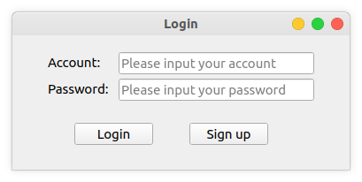
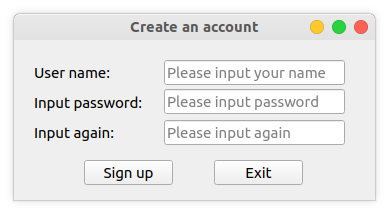
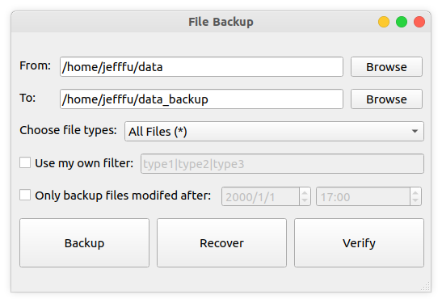
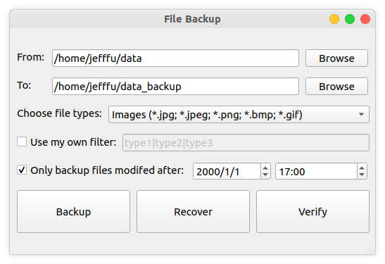
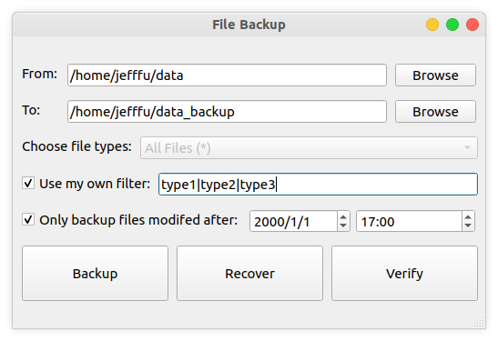

# File-Backup-System

A file backup system implemented in C/C++, see the [docs](docs/README.md) for more details.

## GUI

### Login

Use a registered account to login.

### Sign up

Register a new account.

### Backup

Setup backup options.

#### Use filters

Select or define file filters.

